## 환영합니다.

이 곳은 [Udemy 의 Angela Yu 강의](https://www.udemy.com/course/flutter-bootcamp-with-dart/)를 보면서 스터디하는 분들이 모두 함께 만들어가는 저장소입니다.
매주 학습하고 작성했던 Flutter/Dart 코드를 리뷰 받을 수 있는 공간이기도 합니다.
매주 PR 을 올려주시면, 운영진을 포함하여 함께 참여하시는 분들이 서로 코드를 리뷰해드립니다.

#### 리뷰를 받기 위해서는?

`개인별 브랜치(Branch)에 PR 생성을 해주셔야 합니다.`

#### 브랜치(Branch)? PR...?

###### Branch

`Branch 는 하나의 저장소 내에서 독립적으로 작업을 진행하기 위한 또 하나의 공간입니다.`

###### Pull Request

`PR 은 Pull Request 의 약자입니다.`

---

## 스터디 과제 제출을 위한 PR 생성방법!

#### 1. 먼저 PC 에 Git 또는 Git GUI Client 를 설치합니다.

+ Windows OS 인 경우,
  + [Git Official site](https://git-scm.com) 에 접속하거나, Choco 를 이용하여 설치
  + Git GUI Client 는 [Sourcetree](https://www.sourcetreeapp.com), [Fork](https://git-fork.com), [GitKraken](https://www.gitkraken.com) 추천

+ MacOS 인 경우,
  + [Git Official site](https://git-scm.com) 에 접속하거나, Homebrew 를 이용하여 설치
  + Git GUI Client 는 [Sourcetree](https://www.sourcetreeapp.com), [Fork](https://git-fork.com), [GitKraken](https://www.gitkraken.com) 추천

+ Linux 인 경우,
  + 각 Linux 패키지 매니저를 이용하여 설치
  + Git GUi Client 는 [GitKraken](https://www.gitkraken.com) 을 추천

> [Git SCM GUI Clients](https://git-scm.com/downloads/guis) 로 접속하면, 다양한 GUI Client를 확인할 수 있습니다.

#### 2. Github 스터디용 저장소를 Fork 합니다.

+ [FLUS Angela Yu 스터디용 Github 저장소](https://github.com/flus-dev/study-with-angela-yu) 접속
+ 우측 상단의 Fork 버튼을 클릭합니다.
  + 
  + 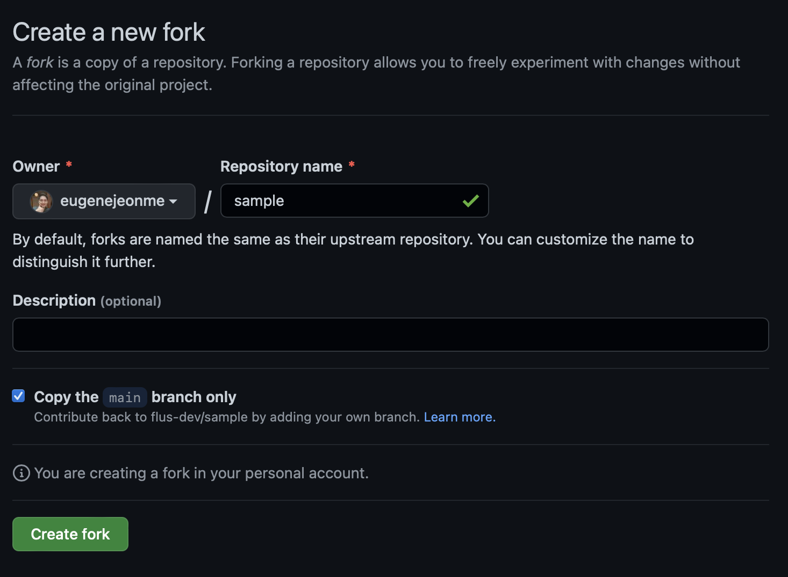

+ Fork 된 자신의 저장소를 확인합니다.
  + 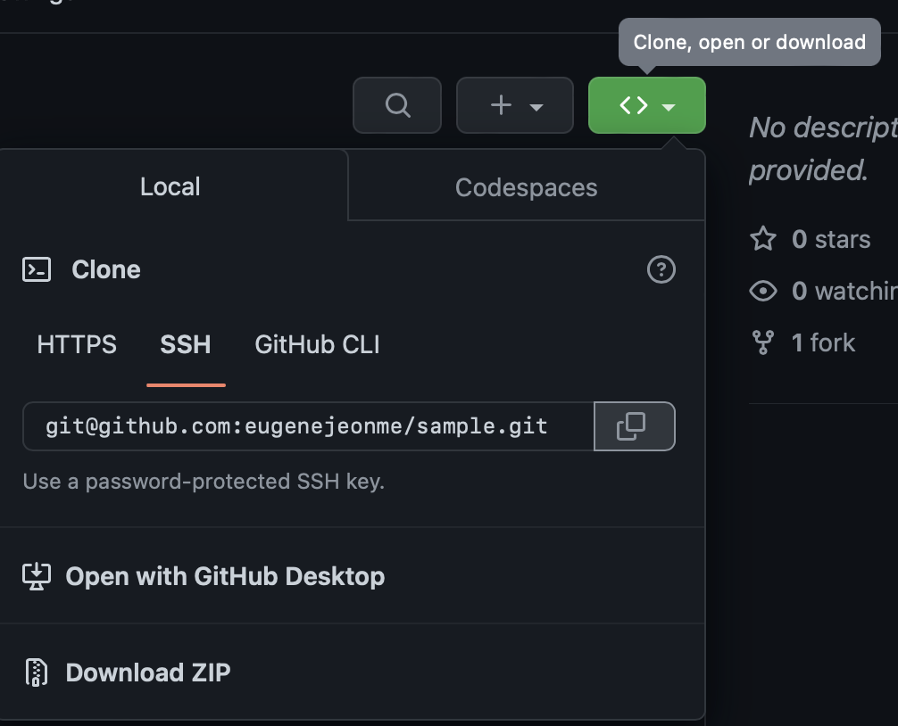

> 각자 확인되어야 할 주소는 <span style="color:red;">`https://github.com/`<Github 유저명>/study-with-angela-yu</span> 입니다.

#### 3. Flutter 설치

[공식 사이트](https://flutter-ko.dev/docs/get-started/install) 를 확인하여, OS 에 맞는 방법으로 설치

#### 4. Flutter/Dart 프로젝트 생성

```bash
$ flutter create --org dev.flus -a kotlin -i swift <프로젝트명>
```

###### 옵션 설명

+ `--org`
  + 패키지명과 식별자를 결정하는 옵션으로 작성하는 것을 권장합니다.
  + 주의! 띄워쓰기에 대한 정책이 Android/iOS 각각 다르므로 주의합니다.
    + Android 는 `-(하이푼)` 을 허용하지 않으며,
    + iOS 에서는 `_(언더바)` 를 허용하지 않습니다.

+ `-a`
  + Android Language 설정 옵션

+ `-i`
  + iOS Language 설정 옵션

#### 5. 생성된 프로젝트에 Git 셋업

```bash
$ git init
```

#### 6. 프로젝트에 Github 셋업

###### 6-1. git config 설정

```bash
git config user.email <유저 이메일>
git config user.name <유저 이름>
```

> `git config --global` 옵션을 사용하면, 전역 설정이 되어, 다른 프로젝트에서도 적용된다.

###### 6-2. git remote repository 를 github repository 로 설정

+ 콘솔을 이용할 경우,
  + ```
    $ git remote add origin <fork 했던 본인의 github repository 주소>
    $ git remote add flus git@github.com:flus-dev/study-with-angela-yu.git
    $ git fetch
    ```

+ Fork GUI Client 를 이용할 경우,
  + <span style="color:red;">Fork workspace 를 프로젝트 폴더로 설정한 이후...</span>
  + 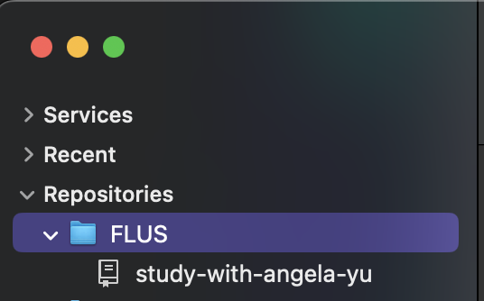
  + 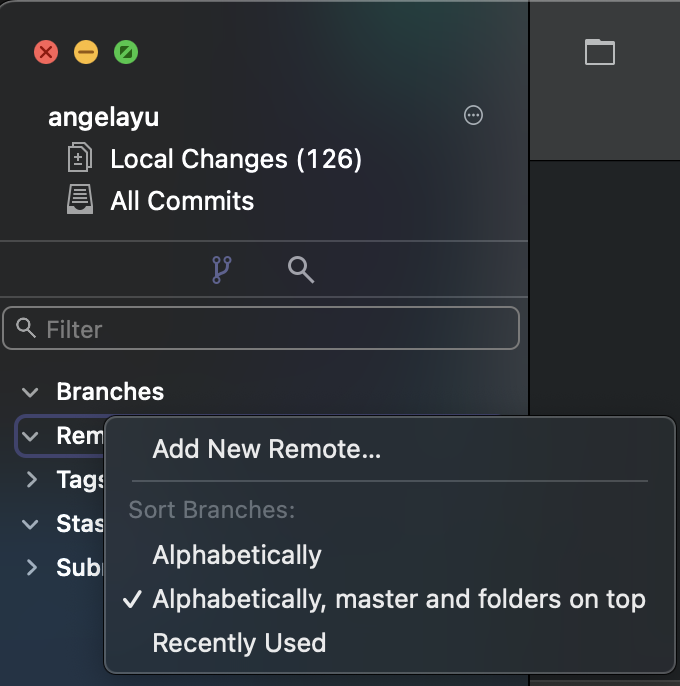
  + 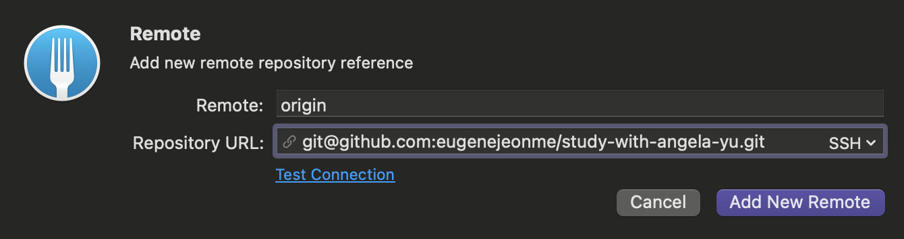
  + 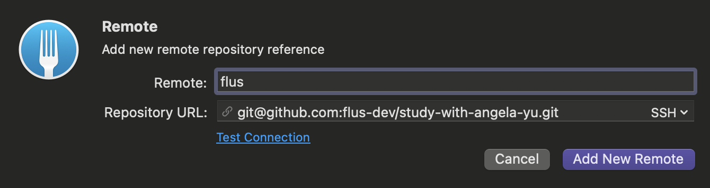
  + 항상! Fetch 생활화 하기!!

> Fork 사용시, 'Repositories' 가 보이지 않는다면?
> 아래 사진에 보이는 메뉴, <span style="color:red;">Rescan Repositories...</span> 를 클릭하면, Repositories 가 보인다.
> 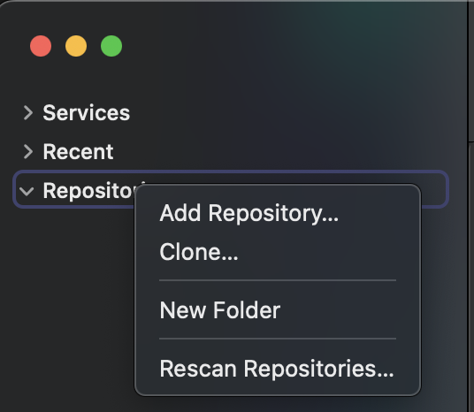

> FLUS Github Repository 를 Upstream Repository 로 설정하고 싶을 때는 아래, [기타 참고](#flus-github-repository-를-upstream-repository-로-설정하고-싶을-때) 를 확인합니다.

#### 7. FLUS Github Repository 에 생성된 Flutter 프로젝트 코드 푸시 (업로드)

+ 콘솔을 이용할 경우,
  + ```
    $ git fetch
    $ git push flus main:<본인의 github 이름>
    ```

+ Fork GUI Client 를 이용할 경우,
  + Fetch 를 항상 먼저 실행
    + 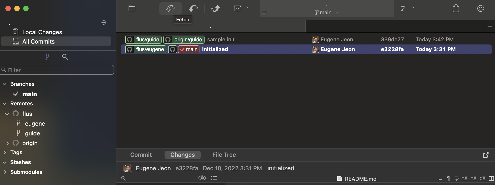
  + Push 버튼을 클릭
    + 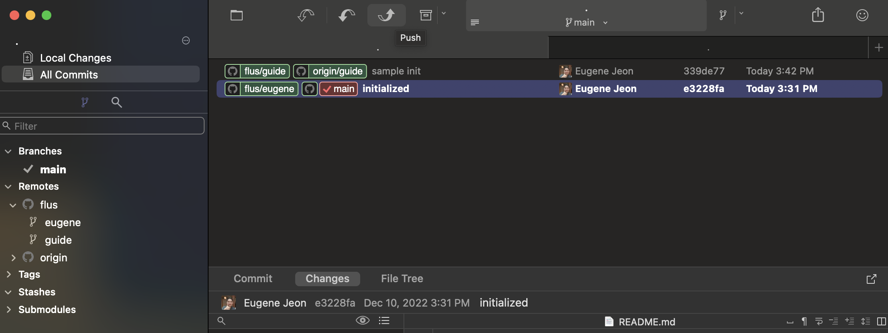
  + Remote 를 변경한 이후
    + 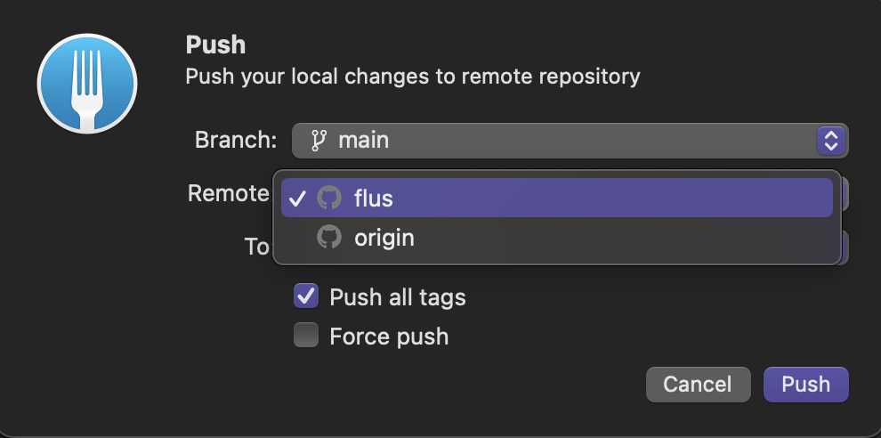
  + To 부분에는 <본인의 github 이름> 으로 입혁하고 Push!
    + 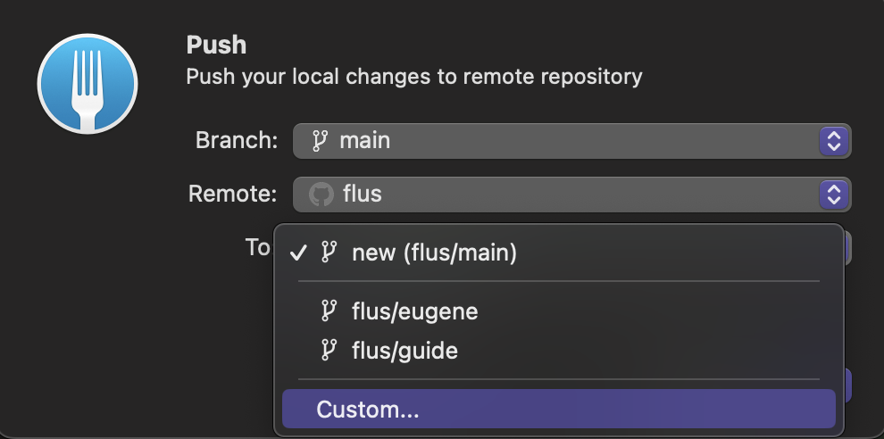

> 임의의 브랜치(Branch) 명으로 푸시할 경우 소유주 확인이 힘드니, 꼭! <u>**깃헙(Github) 이름으로 푸시**</u> 부탁드립니다. 양해 부탁드립니다.

#### 8. 스터디 & 코드 작성

> 스터디는 매주 자유롭게 진행합니다.
> 모각코 이벤트는 매일 진행하며, 자율 참석 가능합니다.

#### 9. 작성한 코드 Github (Remote Repository) 에 Push 하기

+ 콘솔을 이용할 경우,
  + ```bash
      $ git add .
      $ git commit -m "커밋 메시지"
      $ git push
    ```

+ Fork GUI Client 를 이용할 경우,
  + Local Changes (n) 확인
    + 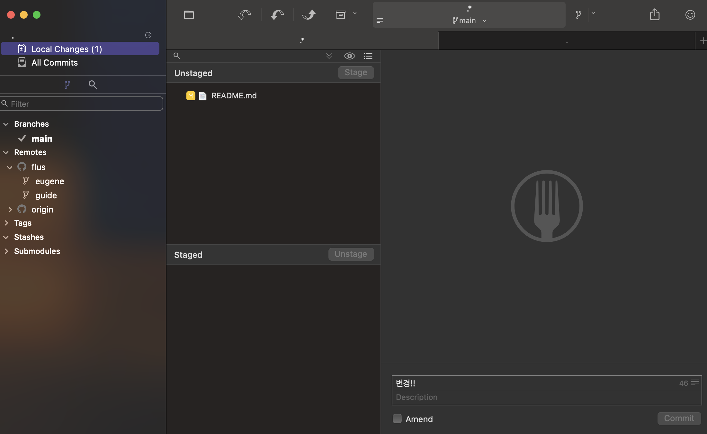
  + Unstaged 에 있는 파일 확인해서 Stage 로 옮긴 뒤, commit message 작성 및 Commit!
    + 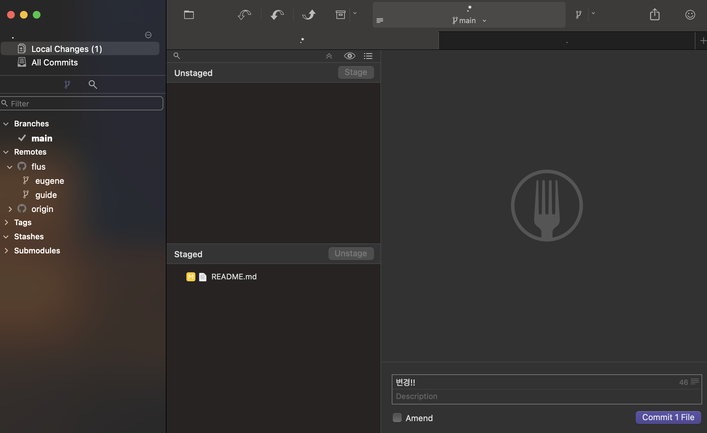
  + Push!
    + 

+ 기타 GUI client 를 이용할 경우, 각각의 공식 문서를 참고하세요.

#### 10. [중요! 과제제출!!] Github 에서 PR (Pull Request) 만들기

+ 본인 Github 저장소 접속 또는 [FLUS Angela Yu 스터디용 Github 저장소](https://github.com/flus-dev/study-with-angela-yu) 접속
+ Github 상단 메뉴의 <span style="color:red;">Pull requests</span> 클릭
  + 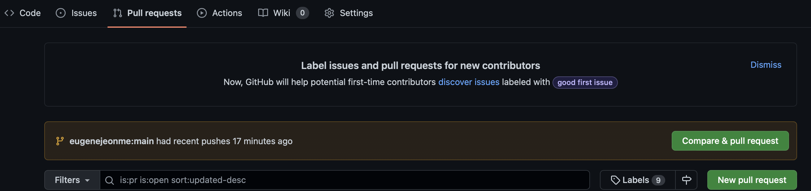
+ 화면의 <span style="color:red;">Compare & pull request</span> 또는 <span style="color:red;">New pull request</span> 클릭
  + 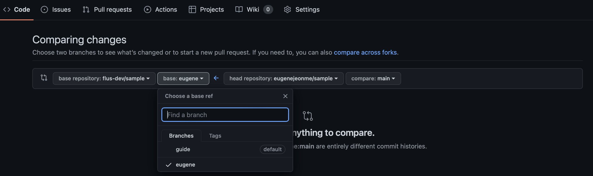
+ 좌측 <span style="color:red;">base</span> 에는 <u>FLUS 의 Github repository 에 있는 본인의 Branch 선택</u>
  + 항상 <span style="color:red;>좌측 base 와 우측 compare 를 확인할 것!</span>
  + 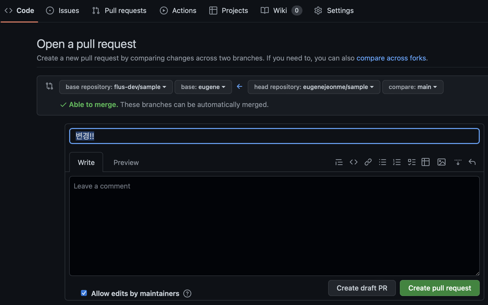

